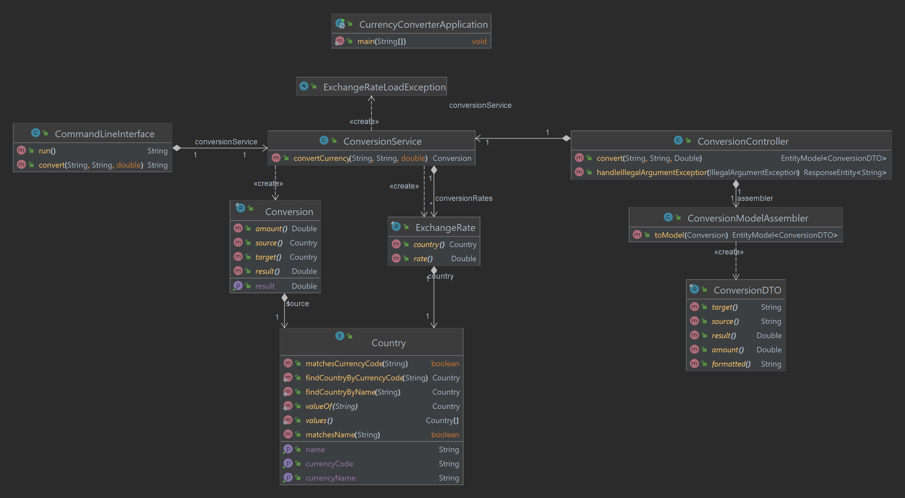
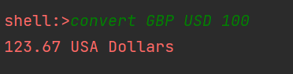
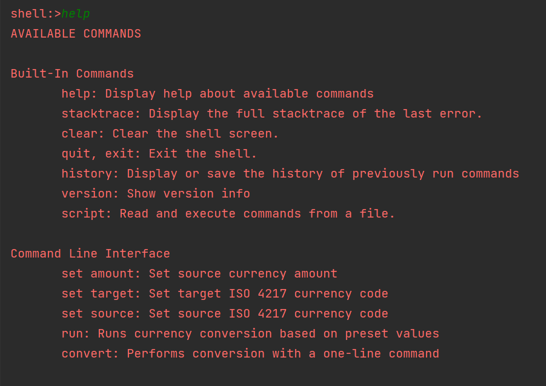
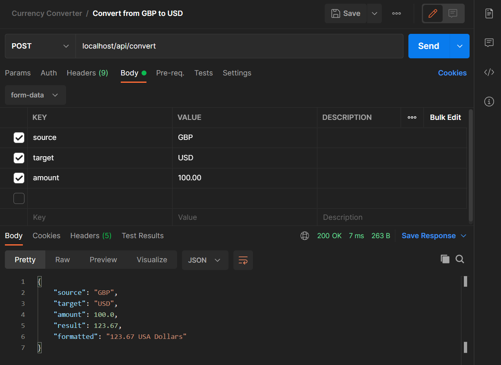

# Currency Converter

This is a simple currency converter application built using Spring Boot and JDK-17.

## Project Organisation
This is a simple implementation composed of: 1) a conversion service containing the main application logic,  and 2) domain classes used to model the data entities such as countries, exchange rates and conversions. It exposes a CLI interface and a REST API.

The conversion service orchestrates the conversion process. It uses the domain classes to represent and manipulate currency-related information.

The domain classes adhere to strong object-oriented principles, encapsulating data and behaviour related to currencies.

This approach ensures a structured and organised way to handle currency conversions, promoting modularity, reusability and maintainability.

## Command Line Interface
The command line interface is implemented using Spring Shell. It supports the following interactions:

### 1. Currency conversion in one line:

`convert <source> <target> <amount>`

where source and target are ISO 4217 currency codes, and amount is in the format 0.00.

### 2. Step-by-step currency conversion: 

This allows the amount, source and target currencies to be set independently before the conversion is executed.

#### Set the source currency:
`set source <currency>`

where currency is an ISO 4217 currency code.

#### Set the target currency:
`set target <currency`

where currency is an ISO 4217 currency code.

#### Set the amount to convert:
`set amount <amount>`

where amount is in the format 0.00.

#### Execute the conversion:
`run`

### 3. Help:
The CLI provides built-in as well as custom help documentation.

## REST API
The application exposes a simple RESTful API for integration with other services. 

## Run using Docker
### Build the image

Run the `bootBuildImage` Gradle task.

Alternatively, the latest image can be downloaded from [DockerHub](https://hub.docker.com/repository/docker/tvergilio/currency-converter/general).

### Run the application

`docker run -p 80:8080 -it -t tvergilio/currency-converter`

## Exchange Rate Data

The exchange rates were obtained from: https://www.gov.uk/government/publications/hmrc-exchange-rates-for-2023-monthly

They are read from a static file stored in `src/main/resources/exchange-rates.csv`

## Deployment Information

This cloud-native application has been deployed to AWS and is available for demonstration upon request.

## License
Copyright (c) 2023 Thalita Vergilio

Permission is hereby granted, free of charge, to any person obtaining a copy
of this software and associated documentation files (the "Software"), to deal
in the Software without restriction, including without limitation the rights
to use, copy, modify, merge, publish, distribute, sublicense, and/or sell
copies of the Software, and to permit persons to whom the Software is
furnished to do so, subject to the following conditions:

The above copyright notice and this permission notice shall be included in all
copies or substantial portions of the Software.

THE SOFTWARE IS PROVIDED "AS IS", WITHOUT WARRANTY OF ANY KIND, EXPRESS OR
IMPLIED, INCLUDING BUT NOT LIMITED TO THE WARRANTIES OF MERCHANTABILITY,
FITNESS FOR A PARTICULAR PURPOSE AND NONINFRINGEMENT. IN NO EVENT SHALL THE
AUTHORS OR COPYRIGHT HOLDERS BE LIABLE FOR ANY CLAIM, DAMAGES OR OTHER
LIABILITY, WHETHER IN AN ACTION OF CONTRACT, TORT OR OTHERWISE, ARISING FROM,
OUT OF OR IN CONNECTION WITH THE SOFTWARE OR THE USE OR OTHER DEALINGS IN THE
SOFTWARE.